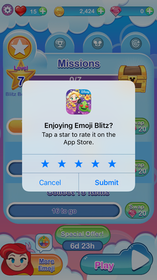
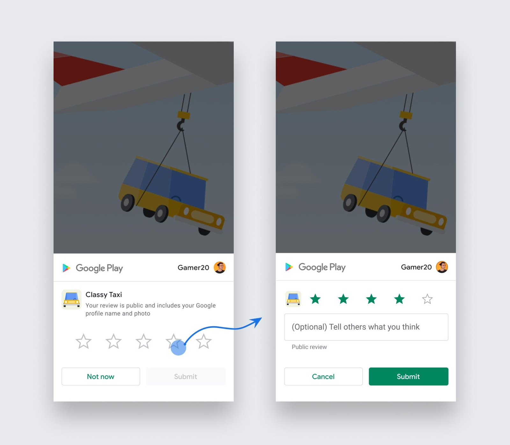

# Usage

Rate app features uses Native Store Review dialogs which are system dialogs and there are limits on how many times these are shown.












### Confirmation Prompt (optional)

Before showing the exact store rating/review dialog, you can optionally ask if the user is really ready to rate the app. You can configure the dialog in the [settings](setup.md#properties) and also you can set this to off if you don't want to show it.


Make use of confirmation dialog as there are limits on how many times a rate dialog can show up on each native platform


### Limitations

To prevent spamming the user for rating the app, each native platform has their own limitations.\
So, its wise to prompt the user only when it's the right time. For ex: Showing the prompt after 10 levels of gameplay or when player archives something big while playing the game.


On iOS, there is a max cap of 3 times per year.\
On Android limited quota do exists and the information is not public about how many times it's allowed.


### Ask for Review

If you don't want to wait for the default controller timings set in  [settings](setup.md#properties), you can anytime call the rate app with **AskForReviewNow** method.

```csharp
using VoxelBusters.EssentialKit;

//...

RateMyApp.AskForReviewNow();
```

### Custom Controller for scheduling Rate Dialog

By default, Rate prompt will be scheduled to prompt automatically based on the default control settings setup in [settings](setup.md#properties). But, if you want to have more control, you can add a component which implements **IRateMyAppController(doc)** interface.

By implementing **IRateMyAppController,**  you can control when to show the prompt and get callbacks to the user clicks for confirmation dialog.

Have a look at **RateMyAppDefaultController** for getting an idea on how to implement your own **IRateMyAppController.**
